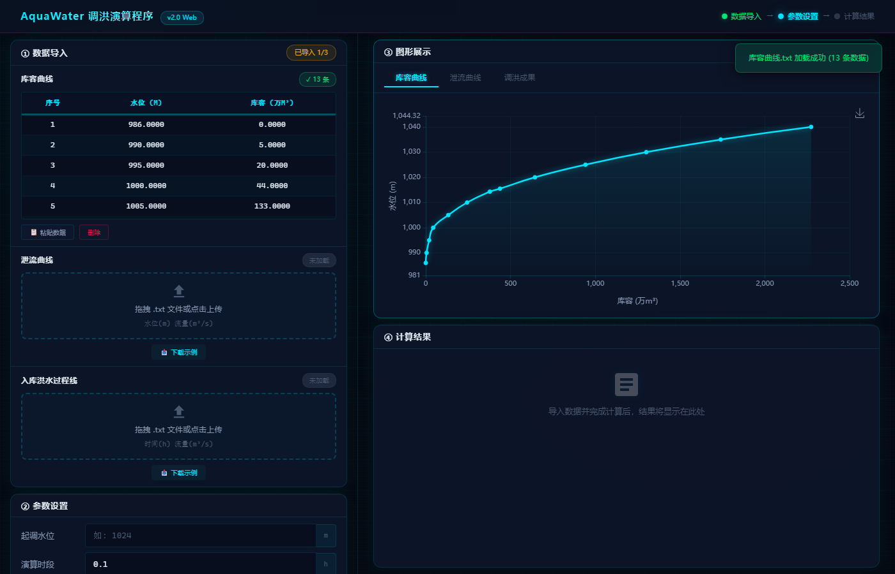
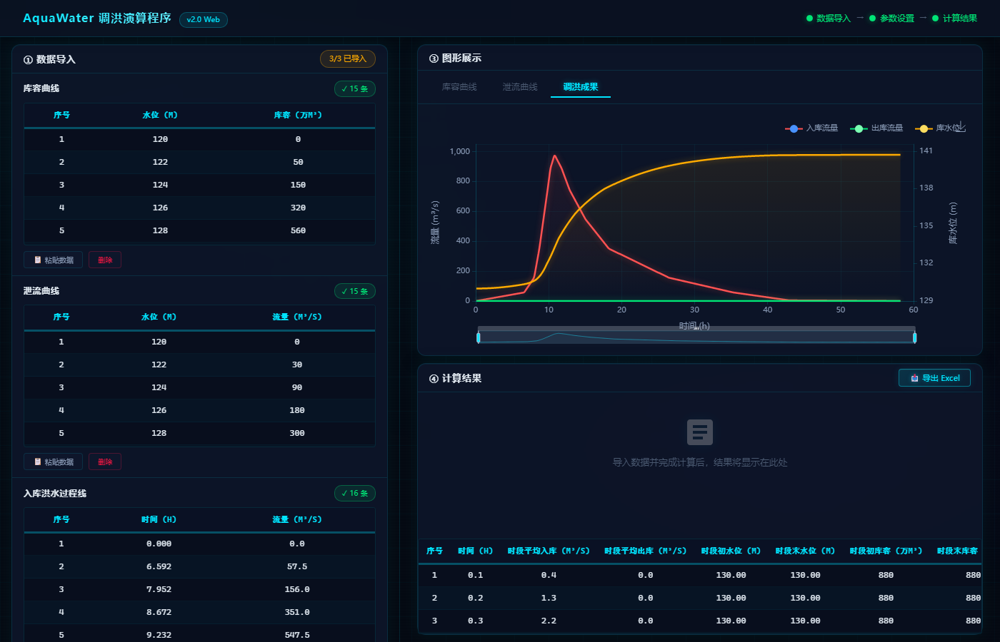
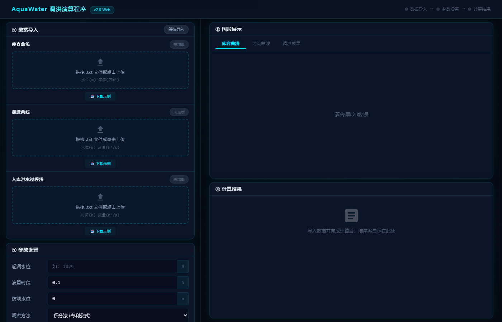

# 老树发新芽：AI 协助下重写水文小工具

> 一个十几年前的 C# 桌面程序，如何在 AI 的帮助下焕然一新，变身现代化 Web 应用。

---

## 一、缘起：一个沉睡多年的老程序

多年前，我用 C# WinForms 写了一个水库调洪演算工具。功能没问题——输入库容曲线、泄流曲线、洪水过程线，选择计算方法，就能算出调洪最高水位、最大下泄流量等关键指标，还能导出 Excel 成果表。

但它有几个硬伤：

- 🖥️ **只能在 Windows 上跑**，换个电脑就得重新安装
- 📦 **依赖 .NET Framework**，部署麻烦
- 🎨 **界面停留在 XP 时代**，灰框白底，毫无美感
- 🌐 **无法远程使用**，同事要用必须拷贝整个文件夹

有过想把他改造为WEB版，但始终没时间，而且习惯了C/S开发，对B/S开发不熟悉。直到最近，AI的革命让我决定试一试。

---

## 二、技术选型：从桌面到云端

原版是 C#，核心算法大约 800 行，包含了三种调洪方法：

| 方法 | 说明 |
|------|------|
| 积分法（专利公式） | 个人专利算法，高效稳定 |
| 龙格库塔法 | 四阶数值解法，经典算法 |
| 迭代法 | 逐步逼近，兼容性好 |

重写目标很明确：**Python + Flask → 浏览器即用**。

后端用 Flask 提供 REST API，前端用原生 HTML/CSS/JS + ECharts 做可视化，生产环境用 Waitress 部署，支持 HTTPS 和速率限制。

整个过程，AI 完成了约 **80% 的代码量**——从算法翻译、API 设计、前端布局到安全加固，我只负责审查和微调。

---

## 三、功能介绍：三步完成一次调洪演算

打开浏览器，访问 `http://aquawater.cn:8090`，界面分为左右两栏，流程清晰：

### 操作流程演示

> 下图是完整的操作流程录屏，展示了从导入数据到输出结果的完整过程：

### 第一步：导入数据

支持拖拽上传、点击上传、粘贴导入三种方式。系统自动解析 Tab/逗号/空格分隔的文本文件，并在表格中展示预览。

表格支持 **原地编辑**，如果某个数据点需要微调，双击单元格直接改，图表实时刷新。

### 第二步：设置参数 & 开始计算

填入起调水位、初始库容、时段长，选择计算方法，点击「开始调洪演算」——或者直接按 `Ctrl + Enter`。

### 第三步：查看结果

计算结果包含：

- 📊 **特征值卡片**：调洪最高水位、最大库容、最大下泄流量、滞洪库容
- 📈 **过程线图表**：入库流量、出库流量、库水位三条曲线叠加显示
- 📋 **逐时段成果表**：每个时段的水位、库容、流量明细
- 📥 **一键导出 Excel**：带格式的成果表，直接用于报告

三种曲线都可以在右侧面板切换查看：库容曲线、泄流曲线、入库洪水过程线，导入即出图。

---

## 四、AI 协作实录：效率提升 10 倍

分享几个印象深刻的瞬间：

### 4.1 算法翻译：C# → Python

800 行 C# 的水库调度算法，涉及大量的数组操作、线性插值、数值积分。我把代码贴给 AI，它几乎零误差地翻译成了 Python，连边界条件的处理都注意到了。

**人工预估：** 20~30 天  
**AI 辅助实际：** 2~3 天审查 + 微调

### 4.2 前端从零搭建

「帮我写一个科技感的数据面板，左边是数据导入区，右边是图表展示区，支持暗色主题……」

几分钟后，一个完整的 HTML + CSS + JS 框架就出来了。后续的调整——表头固定、图表切换、响应式适配——基本都是一句话的事。

### 4.3 安全加固

「关闭 Flask debug 模式，换 Waitress 生产服务器，加上速率限制，上传文件限制 16MB」——五分钟后，一个生产级的 Web 服务就绪。

### 4.4 Bug 修复

最让我惊讶的是调试效率。以前遇到一个 CSS 表头滚动穿透的 Bug，可能要查半小时文档。现在描述一下现象，AI 直接定位到 `rgba(0,229,255,0.08)` 透明度太低导致数据行透出，改一行 CSS 就好了。

---

## 五、部署上线

服务器是阿里云 Windows Server，也可以让AI 帮我一键上传、自动配置，完全不用人管。

在线体验地址：**http://aquawater.cn:8090**

---

## 六、总结与展望

这次重写经历让我对 AI 辅助开发有了全新的认识：

| 维度 | 传统开发 | AI 辅助 |
|------|---------|---------|
| 代码产出速度 | 1x | 5~10x |
| Bug 修复速度 | 1x | 3~5x |
| 跨语言移植 | 需要学新语言 | 直接翻译 |
| UI 设计 | 需要设计师 | 描述即可生成 |
| 安全配置 | 容易遗漏 | 全面覆盖 |

**核心感悟**：AI 不是替代开发者，而是让开发者的能力边界大幅扩展。以前「没时间做」的事情，现在「顺手就做了」。

下一步计划：
- [ ] 增加更多水文计算模块（调洪演算只是第一步）
- [ ] 支持多语言（中/英）

---

> **🌊 AquaWater 调洪演算程序**  
> 在线体验：http://aquawater.cn:8090  
> 
> *如果你也是水利人，欢迎来试试这个小工具。好用的话，告诉你的同事；有问题的话，告诉我。*
